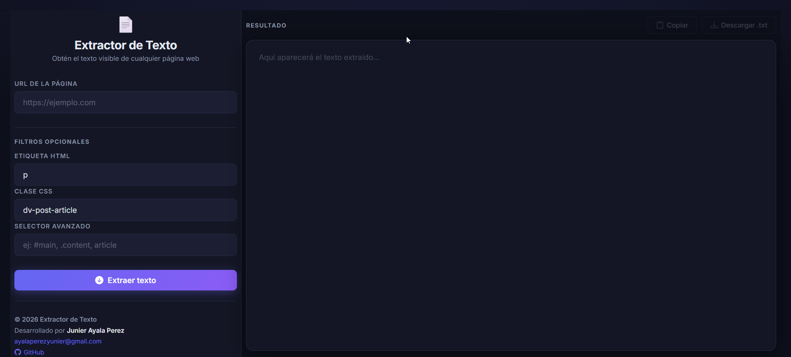

# Extractor de Texto desde una URL

> Aplicación web que obtiene el contenido HTML de cualquier URL, extrae su texto visible, permite copiarlo al portapapeles y descargarlo como `.txt`. Funciona completamente en el navegador, sin backend ni instalación.



---

## Características

- Layout dividido: panel de controles **(30%)** + panel de resultado **(70%)**
- Filtra por **etiqueta HTML** (`p`, `h1`, `span`, `li`…) — extrae todos los elementos de esa etiqueta
- Filtra por **clase CSS** — extrae todos los elementos que tengan esa clase
- Filtra por **selector CSS avanzado** (`#id`, `.clase`, `etiqueta`) — extrae el primer elemento coincidente
- Sin filtros: extrae todo el texto visible del `<body>`
- Reintenta automáticamente con **3 proxies CORS** en cascada (timeout de 8 s por proxy)
- Botón **Copiar** al portapapeles con feedback visual
- Botón **Descargar .txt**
- Botones deshabilitados hasta que haya texto extraído
- Tema oscuro moderno con tipografía **Inter** (Google Fonts)
- Diseño **responsive** (en móvil los paneles se apilan verticalmente)

---

## Requisitos

Solo necesitas un navegador moderno (Chrome, Firefox, Edge, Safari).  
No se requiere instalar nada, ni Node.js, ni servidor local.

---

## Uso rápido

1. Descarga o clona el repositorio.
2. Abre `index.html` directamente en tu navegador (doble clic o arrastrar al navegador).
3. Escribe la URL de la página que quieres procesar.
4. Configura los filtros opcionales si lo necesitas.
5. Haz clic en **Extraer texto**.
6. Usa **Copiar** o **Descargar .txt** para guardar el resultado.

---

## Estructura del proyecto

```
Extractor-texto-paginas-web/
├── index.html        # Estructura y layout de la aplicación
├── styles.css        # Estilos (tema oscuro, layout 30/70, responsive)
├── script.js         # Lógica de extracción, proxies y acciones
├── public/
│   └── 1.png         # Captura de pantalla de la aplicación
├── docs.md           # Documentación técnica detallada
└── readme.md         # Este archivo
```

---

## Cómo usar los filtros

Los filtros se aplican en orden de prioridad. Solo se usa el primero que tenga valor:

| Prioridad | Campo                 | Descripción                                              | Ejemplo                            |
| --------- | --------------------- | -------------------------------------------------------- | ---------------------------------- |
| 1         | **Etiqueta HTML**     | Extrae el texto de _todos_ los elementos de esa etiqueta | `p`, `h2`, `li`                    |
| 2         | **Clase CSS**         | Extrae el texto de _todos_ los elementos con esa clase   | `article-body`, `post-title`       |
| 3         | **Selector avanzado** | Extrae el texto del _primer_ elemento que coincida       | `#main`, `.content > p`, `article` |
| —         | _(sin filtros)_       | Extrae todo el texto visible del `<body>`                | —                                  |

---

## Cómo funcionan los proxies CORS

Los navegadores bloquean las peticiones directas a dominios externos por política de seguridad (**CORS**). La aplicación resuelve esto enrutando la petición a través de proxies públicos.

Se prueban en cascada con un timeout de **8 segundos** por intento:

| #   | Proxy                     | Respuesta               |
| --- | ------------------------- | ----------------------- |
| 1   | `corsproxy.io`            | HTML directo            |
| 2   | `api.allorigins.win`      | JSON → campo `contents` |
| 3   | `thingproxy.freeboard.io` | HTML directo            |

> Si los tres proxies fallan, la aplicación muestra un mensaje de error.

---

## Limitaciones conocidas

- No funciona con páginas que requieren **autenticación** (login).
- Sitios con **protección anti-bots** (Cloudflare, etc.) pueden bloquear los proxies.
- Contenido generado dinámicamente con JavaScript (**SPAs**) puede aparecer vacío, ya que los proxies devuelven el HTML estático inicial.
- Los proxies son **servicios gratuitos de terceros** y pueden tener límites de uso o latencia variable.

---

## Autor

Desarrollado por **Junier Ayala Perez**  
📧 [ayalaperezyunier@gmail.com](mailto:ayalaperezyunier@gmail.com)  
🐙 [github.com/YunierAyala2000](https://github.com/YunierAyala2000)

---

## Licencia

Este proyecto es de uso libre. Puedes modificarlo y distribuirlo con atribución al autor.
